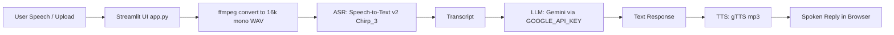

# Google Build and Blog 2025
# Project: Google Cloud Billing Agent

This project is for Google Build and Blog 2025. It is a Google Cloud Billing Voice Agent built as a Streamlit app deployed on severless Google Cloud Run. Users speak a question about their Google Cloud bill. The captured audio is sent to Google Cloud Speech-to-Text v2 using the Chirp model (for example, chirp_3). The transcript is then passed to Gemini 2.5-Flash-Lite via the google-generativeai Python SDK to reason about the user’s billing question, select exactly one action per turn via a structured JSON contract, and return a final answer. Responses are converted to speech using gTTS .

---

## Tech Stack
1. **Streamlit UI (`app.py`)**
   - Captures microphone audio (or accepts uploads).
   - Saves to a temp file and converts to 16k mono WAV via ffmpeg (Cloud-Run safe).
2. **ASR: Speech-to-Text v2 (Chirp 3) (`utils/audio_utils.py`)**
   - Calls regional STT v2 endpoint (`us-speech.googleapis.com`).
   - Uses ephemeral recognizer: `projects/{project}/locations/us/recognizers/_`
   - Model: `chirp_3`
3. **LLM: Gemini (`utils/llm_utils.py`)**
   - Uses `GOOGLE_API_KEY` and `LLM_MODEL` (default: `gemini-2.5-flash-lite`).
4. **TTS: gTTS (`utils/audio_utils.py`)**
   - Converts Gemini response to mp3 and plays it in browser.
5. **Deploy**
   - Container built with Cloud Build → stored in Artifact Registry/GCR → deployed to Cloud Run.

## Architectural Diagram


## System Components
1. **Streamlet Frontend (`app.py`)**
Users interact through a simple voice UI built in Streamlit. It captures microphone audio from the browser using st.audio_input, displays transcripts, writes AI responses, and plays generated speech for local testing. The UI provides settings like recording duration, various tab selections for analyzing text & conversation, and viewing conversation history.

2. **Audio Processing Layer**
This layer handles audio coming from Streamlit or file uploads. It supports optional waveform visualization and routes audio into speech recognition. It also handles text-to-speech synthesis for replies when running the pipeline locally.

3. **Google Chirp (chrip_3 ASR)**
Google Chirp enables real-time transcription across many languages, allowing support for global Google Cloud customers. It performs speech-to-text and returns transcriptions for reasoning and structured action selection.

4. **Intelligence Layer (LLMProcessor powered by Gemini)**
The transcribed text is passed to a Gemini model which interprets intent, generates helpful responses, and follows a strict contract of emitting one JSON action per turn. Supported mock actions include a. looking up billing policies, b. discounts or usage rules, c. gathering account identifiers and d. creating ticket summaries for follow-up.

This transforms the app from a simple Q&A bot into a practical, mock call-center agent capable of pulling defined levers. It behaves agentic because the LLM doesn’t just generate text—it decides an action in a structured JSON contract, then the code executes that action (get_account, get_policy, create_ticket) and returns the result. The agency comes from the model choosing a lever each turn based on conversation context. 

5. **Further Backend Developement (Firestore)**
Further work can be done to call real GCP APIs in lieu of mock data. Responses, transcripts, or ticket summaries can be logged to Google Firestore for analytics & follow-up. 

## Data Flow
User Voice → Chirp (`chirp_3`) → Text Transcript → Gemini 2.5-Flash-Lite → One JSON Action Emitted →
Mock Lever Execution (`get_account`, `get_policy`, `create_ticket`) → Natural-Language Answer → TTS Reply

## Instructions to Run the Project
1. Clone the repository in the Cloud Run terminal
```
git clone https://github.com/BoydBLever/Google-Cloud-Billing-Agent.git
cd Google-Cloud-Billing-Agent
```

2. List your Google Cloud projects
```
gcloud projects list
```

3. Set your active Google Cloud project in Cloud Shell. Once you get a Project ID, set it like this:
```
gcloud config set project YOUR_PROJECT_ID
```
For example, my command was:
```
gcloud config set project elite-protocol-479210-n4
```

4. Enable required services for Cloud Run deploy
```
gcloud services enable \
run.googleapis.com \
cloudbuild.googleapis.com \
artifactregistry.googleapis.com \
aiplatform.googleapis.com \
speech.googleapis.com
```

Service enablement success outputs a message like this:
```
Operation "operations/acat.p2-155021701306-95be0a20-f588-4f57-ad7f-57e3540848b0" finished successfully.
```

5. Build your container image for Cloud Run. Please remember to update <PROJECT_ID>.
```
gcloud builds submit --tag gcr.io/<PROJECT_ID>/google-cloud-billing-agent .
```

6. Deploy to Cloud Run. Please remember to update <PROJECT_ID>.
```
gcloud run deploy google-cloud-billing-agent \
--image gcr.io/<PROJECT_ID>/google-cloud-billing-agent \
--platform managed \
--region us-central1 \
--allow-unauthenticated \
--port 8080 \
--set-env-vars GEMINI_API_KEY="YOUR_GEMINI_KEY",LLM_MODEL="gemini-2.5-flash-lite",SAMPLE_RATE="16000",SPEECH_LOCATION="us"
```

Your project name might differ from "google-cloud-billing-agent".

7. Useful Google Cloud Shell commands
```
cloudshell edit .
cloudshell edit Dockerfile
cloudshell edit <FILE_NAME>
```

## Cloud Run Platform Notes
Cloud Run cannot access local microphone hardware. Packages like sounddevice and PortAudio will always fail in Cloud Run. Cloud Run cannot play TTS audio through hardware either. All voice capture must be browser-based (st.audio_input from Streamlit), and all speech playback must use browser audio players, not server-side playback. I wrote the code to handle these constraints.

## Authentication and Environment Variables Rules
Cloud Run only receives environment variables set explicitly using --set-env-vars.

- Local `.env` files are ignored in Cloud Run  
- Keys must be passed directly in the deploy command  
- A code change always requires container rebuild + redeploy

You can use the --set-env-vars flag to set multiple environment variables at once. For example:
```
  --set-env-vars GOOGLE_CLOUD_PROJECT="elite-protocol-479210-n4",GOOGLE_API_KEY="YOUR_PRIVATE_KEY",LLM_MODEL="gemini-2.5-flash-lite",SAMPLE_RATE="16000",SPEECH_LOCATION="us"
  ```

If you are logged out or lose active account context, you will see a message simliliar to this:
```
(gcloud.run.deploy) You do not currently have an active account selected.
```
To re-authenticate, run this command and select Y, then redeploy:
```
gcloud auth login
```

## Rules for Passing Keys
For flags like `--set-env-vars`:

- Quotes are only required when shell escaping is needed (spaces, commas, or symbols)  
- Plain alphanumeric values without spaces typically do not require quotes  
- Structured values like project IDs or JSON-like strings are safer when quoted  
- Multiple environment variables can be passed in comma-separated format


## Note on Google Cloud Billing
Make sure your Gemini API Usage is not currently exceeding your rate limit otherwise you may want to adjust your Google AI budget to work with this agent.
